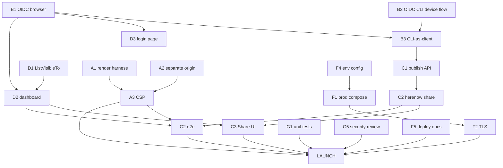

# here.now — Launch Dependency Tree

> Dependency graph and critical path for the launch tasks in [tasks.md](tasks.md).
> A node requires everything that points into it (arrows flow toward LAUNCH).

## ASCII tree

```
                          ┌─────────────────────── LAUNCH ───────────────────────┐
                          │                                                       │
                     [G2 e2e] [G1 unit] [G5 sec review]        [F5 deploy docs]
                          │        │          │                       │
        ┌─────────────────┼────────┴───────┐  │             ┌─────────┴─────────┐
        │                 │                 │  │             │                   │
   RENDER PARITY      SHARING/RBAC      DASHBOARD        [F1 compose]        [F2 TLS]
   ┌────┴────┐        ┌───┴────┐        ┌───┴───┐             │                   │
 [A1 harness]      [C2 share] [C3 UI] [D2 board][D3 login]  [F4 env config]───────┘
   │   │            │    │        │      │  │
 [A3 CSP][A2 origin][C1 publish API]  [D1 ListVisibleTo]
                     │                   │
             ┌───────┴────────┐          │
        [B3 CLI-as-client]    │          │
          │        │          │          │
     [B2 CLI OIDC][B1 browser OIDC]──────┴──────► (auth underpins C3 / D2 / D3)
                     │
              (OIDC issuer configured — infra prerequisite)

  Independent / do-anytime: E1 stream · E2 atomic writes · G4 limits · F3 metrics · G6 audit verify
```

## Mermaid



## Critical path (team launch)

Longest chain to launch:

```
B1 OIDC browser → B3 CLI-as-client → C1 publish API → C2 share → C3 Share UI → G2 e2e → LAUNCH
```

…run in parallel with the independent long pole:

```
A1 render parity → A3 CSP → G2 e2e → LAUNCH
```

The schedule is gated by two parallel tracks — the **auth → sharing chain (B → C)** and the
**render-parity chain (A)**. Deploy (F) and tests (G) sit at the bottom and are built alongside
once features exist. Starting A1 and B1 simultaneously compresses the calendar the most.

## Minimal single-user bar

Delete Scopes B and C entirely plus D2/D3. Critical path collapses to:

```
A1 render parity → A3 CSP → F1/F2 deploy + TLS → G1/G2/G5 tests + sec review → LAUNCH
```

This is the ~2–4 week version.
